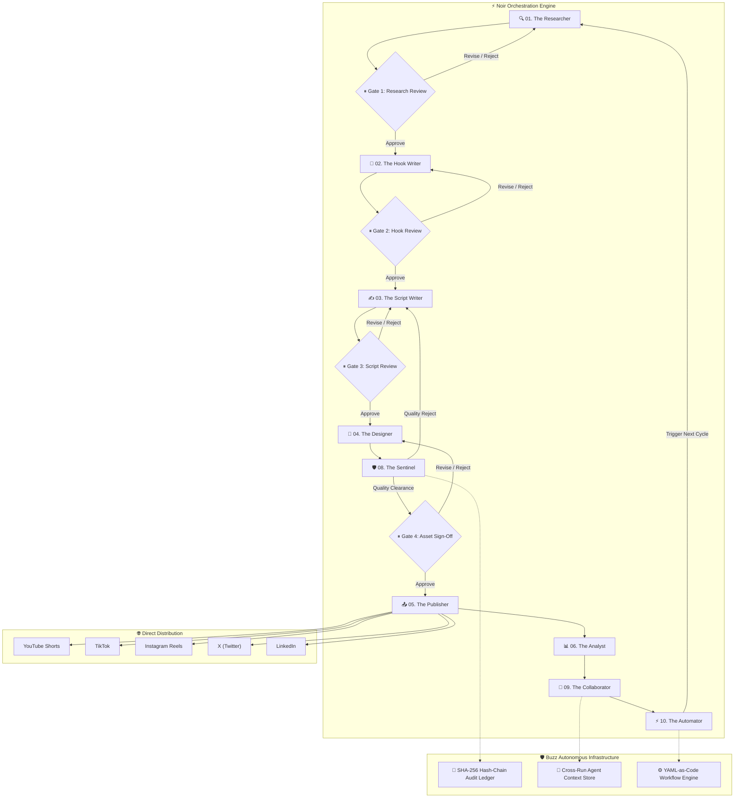

# ⚡ Noir — Autonomous Multi-Agent Content Engine

<div align="center">


[](https://python.org)
[](https://fastapi.tiangolo.com)
[](https://github.com/langchain-ai/langgraph)
[](https://react.dev)
[](https://vitejs.dev)
[](https://github.com/pushkarugale/Noir)
[](https://opensource.org/licenses/MIT)

**Noir** is an enterprise-grade autonomous multi-agent content creation and publishing pipeline powered by **LangGraph**, **FastAPI**, and a high-tech **React SPA**. Ten specialized AI agents collaborate across viral research, copywriting, scripting, design, quality auditing, cross-run context synchronization, and automated multi-channel publishing with **cryptographic hash-chain auditing** and **human-in-the-loop approval gates**.

[Features](#-key-features) • [Buzz Architecture](#-buzz-inspired-architecture) • [Agents](#-the-10-ai-agents) • [Approval Gates](#-human-in-the-loop-gates) • [Quick Start](#-quick-start) • [Platform Setup](#-social-platform-integrations)

</div>

---

## 🌟 Key Features

- 🤖 **10 Autonomous AI Agents**: Specialized units operating in an orchestrated cyclic pipeline.
- 🛡️ **Sentinel Cryptographic Audit Trail**: Tamper-evident SHA-256 hash chains for all agent outputs and approval gate decisions inspired by Buzz's audit architecture.
- 🧠 **Collaborator Cross-Agent Memory**: Persistent session pooling and cross-run context stores so agents learn from historical performance across cycles.
- ⚡ **Automator YAML Workflow Engine**: Declarative workflows with dynamic triggers, cron schedules, and adaptive publishing window recommendations.
- 🛑 **Human-in-the-Loop Checkpoints**: Operator steering with Approve, Revise, and Reject gates with real-time virality and Sentinel quality indexes.
- 🎨 **High-Tech Dark Mode UI**: Custom dark charcoal slate palette (`#252525`, `#414141`) energized with neon crimson red accents (`#ff0000`, `#ff4d4d`), glassmorphism, and live telemetry.
- 🌐 **Direct Multi-Platform Auto-Posting**: Automated uploads to YouTube Shorts, TikTok, Instagram Reels, X (Twitter), LinkedIn, and Reddit.
- 🧠 **Multi-LLM Provider Support**: Dynamic routing across OpenAI (GPT-4o), Anthropic (Claude 3.7 Sonnet), and Google Gemini (Gemini 2.5 Flash / Pro).

---

## 🏗️ System Architecture



---

## 🐝 Buzz-Inspired Architecture

Noir incorporates premier architectural patterns from the **Buzz autonomous agent ecosystem**:

1. **The Sentinel (Quality & Audit Gatekeeper)**:
   - Evaluates deliverables across 5 dimensions: Research Rigor, Hook Virality Velocity, Narrative Pacing, Visual Polish, and Brand Safety.
   - Enforces cryptographic SHA-256 hash chains (`pipeline/audit.py`) linking every state change in an immutable sequence.
2. **The Collaborator (Cross-Agent Context Protocol)**:
   - Employs session pooling and handoff protocols (`pipeline/context_store.py`) to maintain persistent memory across cycles.
   - Summarizes cross-platform learnings into context briefs available to all agents.
3. **The Automator (Workflow Engine)**:
   - Executes YAML-as-code automation recipes (`agents/automator.py`) supporting cron expressions, event triggers, and emergency circuit breakers.

---

## 🤖 The 10 AI Agents

| # | Agent | Department | Core Directive & Responsibilities |
|---|---|---|---|
| **01** | **The Researcher** | Research Dept. | Scours TikTok, YouTube Shorts, Instagram Reels, X, and Reddit for breakout trends before they peak. Scored viral opportunities. |
| **02** | **The Hook Writer** | Creative Dept. | Generates 10 high-converting hooks per idea using proven formulas (Contrarian, Explainer, Story, Proof). Identifies winning hooks. |
| **03** | **The Script Writer** | Creative Dept. | Writes platform-tailored scripts with strict timing: 3s Hook → High-Retention Value → Proof → Clear Call to Action. |
| **04** | **The Designer** | Design Dept. | Formulates visual briefs, carousel slide compositions, thumbnail typography directions, and AI image prompts. |
| **05** | **The Publisher** | Distribution | Executes direct authenticated API publishing across YouTube, TikTok, Instagram, X, and LinkedIn. |
| **06** | **The Analyst** | Insights Dept. | Measures cross-platform engagement and feeds tactical improvements into the cycle feedback loop. |
| **07** | **The Manager** | Operations | Controls LangGraph StateGraph flow, state checkpointing, and WebSocket telemetry broadcasts. |
| **08** | **The Sentinel** | Quality & Audit | Buzz-inspired gatekeeper enforcing strict quality scoring and cryptographic hash-chain ledger verification. |
| **09** | **The Collaborator** | Orchestration | Coordinates cross-agent memory handoffs, session pooling, and knowledge graph persistence. |
| **10** | **The Automator** | Workflow Dept. | Declarative workflow executor, trigger evaluator, and predictive schedule recommendation engine. |

---

## 🛡️ Human-in-the-Loop Gates

Noir ensures AI never posts unsupervised:
1. **Approve & Proceed**: Passes verified deliverables to the next agent.
2. **Request Revision**: Sends steering instructions back to the agent for instant regeneration.
3. **Reject**: Discards underperforming ideas before production costs are incurred.

---

## 🚀 Quick Start

### Prerequisites
- **Python 3.11+**
- **Node.js 18+** & **npm**

### 1. Clone the Repository
```bash
git clone https://github.com/pushkarugale/Noir.git
cd Noir
```

### 2. Set Up Python Backend
```bash
# Create virtual environment
python -m venv .venv

# Activate virtual environment
# Windows (PowerShell):
.venv\Scripts\Activate.ps1
# macOS / Linux:
source .venv/bin/activate

# Install dependencies
pip install -r requirements.txt
```

### 3. Build Frontend Assets
```bash
cd VortexUI-main
npm install
npm run build
cd ..
```

### 4. Configure Environment Variables
Copy `.env.example` to `.env` and provide your API keys:
```bash
cp .env.example .env
```

At minimum, configure **one LLM provider**:
```env
# Choose: "openai", "anthropic", or "google"
LLM_PROVIDER=google
GOOGLE_API_KEY=your_gemini_api_key
```

### 5. Launch Noir

Noir can run **100% in the terminal (zero UI or web server required)** or with the **high-tech React web dashboard**:

#### Option A: Terminal CLI Runner (No UI / Headless)
```bash
# Interactive Human-in-the-Loop CLI (prompts at approval gates)
python main.py --cli

# Fully Autonomous Autopilot CLI (auto-clears gates meeting Sentinel score threshold)
python main.py --cli --autopilot

# Specify cycle number
python main.py --cli --cycle 2
```

#### Option B: Web Dashboard & React UI
```bash
python main.py
```
Open your browser and navigate to:
👉 **[http://localhost:8000](http://localhost:8000)**

---

## 📱 Social Platform Integrations

Add credentials in `.env` to enable direct auto-posting upon approving **Gate 04**:

### 📺 YouTube Shorts (YouTube Data API v3)
```env
YOUTUBE_API_KEY=AIzaSy...
YOUTUBE_CLIENT_ID=your_client_id.apps.googleusercontent.com
YOUTUBE_CLIENT_SECRET=GOCSPX-your_client_secret
YOUTUBE_REFRESH_TOKEN=1//04your_refresh_token
```

### 📸 Instagram Reels (Meta Graph API)
```env
INSTAGRAM_ACCESS_TOKEN=EAABw...
INSTAGRAM_BUSINESS_ACCOUNT_ID=1784140...
```

### 🎵 TikTok (Content Posting API)
```env
TIKTOK_ACCESS_TOKEN=act.your_token
TIKTOK_CLIENT_KEY=your_key
TIKTOK_CLIENT_SECRET=your_secret
```

### 🐦 X / Twitter (API v2)
```env
X_API_KEY=your_consumer_key
X_API_SECRET=your_consumer_secret
X_BEARER_TOKEN=your_bearer_token
X_ACCESS_TOKEN=your_access_token
X_ACCESS_TOKEN_SECRET=your_access_token_secret
```

### 💼 LinkedIn (Marketing API)
```env
LINKEDIN_ACCESS_TOKEN=AQV...
LINKEDIN_ORGANIZATION_ID=urn:li:organization:123456
```

---

## 🗂️ Project Structure

```
Noir/
├── agents/                 # Multi-agent implementations
│   ├── researcher.py       # Agent 01: Trend & Competitor Discovery
│   ├── hook_writer.py      # Agent 02: Viral Hook Formulas
│   ├── script_writer.py    # Agent 03: Script & Caption Generator
│   ├── designer.py         # Agent 04: Visual Briefs & Prompts
│   ├── publisher.py        # Agent 05: Direct API Dispatcher
│   ├── analyst.py          # Agent 06: Analytics & Closed-Loop Feedback
│   ├── manager.py          # Agent 07: State & Telemetry Supervisor
│   ├── sentinel.py         # Agent 08: Quality & Audit Gatekeeper (Buzz)
│   ├── collaborator.py     # Agent 09: Cross-Agent Context & Handoffs (Buzz)
│   ├── automator.py        # Agent 10: Workflow & Triggers Engine (Buzz)
│   └── state.py            # Global pipeline state schema
├── pipeline/               # LangGraph StateGraph & Infrastructure
│   ├── graph.py            # 10-Agent interruptible workflow graph
│   ├── audit.py            # Cryptographic SHA-256 hash-chain ledger (Buzz)
│   ├── context_store.py    # Persistent cross-run memory store (Buzz)
│   ├── approval.py         # Review & steering handlers
│   └── scheduler.py        # Autonomous execution timer
├── platforms/              # Social media API clients
│   ├── youtube.py          # YouTube Data API v3 client
│   ├── instagram.py        # Meta Graph API client
│   ├── tiktok.py           # TikTok Content Posting client
│   ├── twitter.py          # X / Twitter API v2 client
│   ├── linkedin.py         # LinkedIn API client
│   └── reddit.py           # Reddit PRAW client
├── dashboard/              # FastAPI Server & Real-time WebSockets
│   ├── app.py              # API routes, Buzz endpoints, & static dist mounts
│   ├── static/             # Classic CSS/JS fallbacks
│   └── templates/          # Classic HTML fallbacks
├── VortexUI-main/          # High-Tech Dark Mode React SPA
│   ├── src/
│   │   ├── App.tsx         # Command Center, Approvals, Sentinel Audit, Workflows, Analytics
│   │   └── index.css       # Custom dark crimson design tokens
│   ├── dist/               # Production bundle served by FastAPI
│   ├── package.json
│   └── vite.config.ts
├── config.py               # Central environment configuration
├── main.py                 # Application startup entry point
└── requirements.txt        # Python dependencies
```

---

## 📜 License

This project is licensed under the **MIT License** — see the [LICENSE](LICENSE) file for details.

---

<div align="center">
Built by <b>Pushkar Ugale</b> • Powered by LangGraph, FastAPI & Buzz Architecture
</div>
