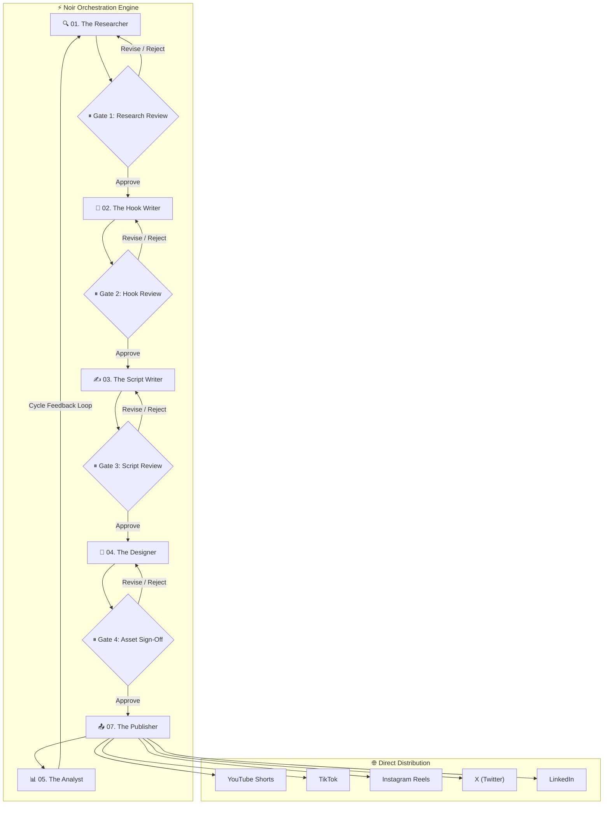

# ⚡ Noir — Autonomous Multi-Agent Content Engine

<div align="center">


[](https://python.org)
[](https://fastapi.tiangolo.com)
[](https://github.com/langchain-ai/langgraph)
[](https://react.dev)
[](https://vitejs.dev)
[](https://tailwindcss.com)
[](https://opensource.org/licenses/MIT)

**Noir** is an autonomous multi-agent content creation pipeline powered by **LangGraph**, **FastAPI**, and a high-tech **React SPA**. Seven specialized AI agents collaborate across research, copywriting, scripting, design, and direct social media publishing with **4 human-in-the-loop approval gates**.

[Features](#-key-features) • [Architecture](#-system-architecture) • [Agents](#-the-7-ai-agents) • [Approval Gates](#-4-human-in-the-loop-gates) • [Quick Start](#-quick-start) • [Platform Setup](#-social-platform-integrations)

</div>

---

## 🌟 Key Features

- 🤖 **Autonomous Multi-Agent Collaboration**: 7 specialized agents operating in a cyclic pipeline.
- 🛑 **4 Human-in-the-Loop Checkpoints**: Complete operator control with Approve, Revise, and Reject gates.
- ⚡ **Real-Time WebSocket Stream**: Live telemetry, active node animations, and streaming activity terminal.
- 🎨 **High-Tech Dark Mode UI**: Custom dark charcoal slate palette (`#252525`, `#414141`) energized with neon crimson red accents (`#ff0000`, `#ff4d4d`).
- 🌐 **Direct Multi-Platform Auto-Posting**: Automated uploads to YouTube Shorts, TikTok, Instagram Reels, X (Twitter), LinkedIn, and Reddit.
- 🧠 **Multi-LLM Provider Support**: Native fallback routing across OpenAI (GPT-4o), Anthropic (Claude 3.7 Sonnet), and Google Gemini (Gemini 2.5 Flash / Pro).

---

## 🏗️ System Architecture



---

## 🤖 The 7 AI Agents

| # | Agent | Department | Core Directive & Responsibilities |
|---|---|---|---|
| **01** | **The Researcher** | Research Dept. | Scours TikTok, YouTube Shorts, Instagram Reels, X, and Reddit for breakout trends before they peak. Delivers scored viral opportunities. |
| **02** | **The Hook Writer** | Creative Dept. | Generates 10 high-converting hooks per idea using proven formulas (Contrarian, Explainer, Story, Proof). Identifies winning hooks. |
| **03** | **The Script Writer** | Creative Dept. | Writes platform-tailored scripts with strict timing: 3s Hook → High-Retention Value → Proof → Clear Call to Action. |
| **04** | **The Designer** | Design Dept. | Formulates visual briefs, carousel slide compositions, thumbnail typography directions, and AI image prompts. |
| **05** | **The Analyst** | Insights Dept. | Measures cross-platform engagement and feeds tactical improvements back into Agent 01 for the next cycle. |
| **06** | **The Manager** | Operations | Controls LangGraph StateGraph flow, state checkpointing, and WebSocket telemetry broadcasts. |
| **07** | **The Publisher** | Distribution | Executes direct authenticated API publishing across YouTube, TikTok, Instagram, X, and LinkedIn. |

---

## 🛡️ 4 Human-in-the-Loop Gates

Noir ensures AI never posts unsupervised. At each checkpoint, the operator has 3 actions:
1. **Approve & Proceed**: Passes verified deliverables to the next agent.
2. **Request Revision**: Sends custom steering instructions back to the agent for instant regeneration.
3. **Reject**: Discards underperforming ideas before production costs are incurred.

---

## 🚀 Quick Start

### Prerequisites
- **Python 3.11+**
- **Node.js 18+** & **npm**

### 1. Clone the Repository
```bash
git clone https://github.com/pushkarugale/Noir.git
cd Noir
```

### 2. Set Up Python Backend
```bash
# Create virtual environment
python -m venv .venv

# Activate virtual environment
# On Windows (PowerShell):
.venv\Scripts\Activate.ps1
# On macOS / Linux:
source .venv/bin/activate

# Install dependencies
pip install -r requirements.txt
```

### 3. Build Frontend Assets
```bash
cd VortexUI-main
npm install
npm run build
cd ..
```

### 4. Configure Environment Variables
Copy `.env.example` to `.env` and provide your API keys:
```bash
cp .env.example .env
```

At minimum, configure **one LLM provider**:
```env
# Choose: "openai", "anthropic", or "google"
LLM_PROVIDER=google
GOOGLE_API_KEY=your_gemini_api_key
```

### 5. Launch Noir
```bash
python main.py
```

Open your browser and navigate to:
👉 **[http://localhost:8000](http://localhost:8000)**

---

## 📱 Social Platform Integrations

Add credentials in `.env` to enable direct auto-posting upon approving **Gate 04**:

### 📺 YouTube Shorts (YouTube Data API v3)
```env
YOUTUBE_API_KEY=AIzaSy...
YOUTUBE_CLIENT_ID=your_client_id.apps.googleusercontent.com
YOUTUBE_CLIENT_SECRET=GOCSPX-your_client_secret
YOUTUBE_REFRESH_TOKEN=1//04your_refresh_token
```

### 📸 Instagram Reels (Meta Graph API)
```env
INSTAGRAM_ACCESS_TOKEN=EAABw...
INSTAGRAM_BUSINESS_ACCOUNT_ID=1784140...
```

### 🎵 TikTok (Content Posting API)
```env
TIKTOK_ACCESS_TOKEN=act.your_token
TIKTOK_CLIENT_KEY=your_key
TIKTOK_CLIENT_SECRET=your_secret
```

### 🐦 X / Twitter (API v2)
```env
X_API_KEY=your_consumer_key
X_API_SECRET=your_consumer_secret
X_BEARER_TOKEN=your_bearer_token
X_ACCESS_TOKEN=your_access_token
X_ACCESS_TOKEN_SECRET=your_access_token_secret
```

### 💼 LinkedIn (Marketing API)
```env
LINKEDIN_ACCESS_TOKEN=AQV...
LINKEDIN_ORGANIZATION_ID=urn:li:organization:123456
```

---

## 🗂️ Project Structure

```
Noir/
├── agents/                 # Multi-agent implementations
│   ├── researcher.py       # Agent 01: Trend & Competitor Discovery
│   ├── hook_writer.py      # Agent 02: Viral Hook Formulas
│   ├── script_writer.py    # Agent 03: Script & Caption Generator
│   ├── designer.py         # Agent 04: Visual Briefs & Prompts
│   ├── analyst.py          # Agent 05: Analytics & Closed-Loop Feedback
│   ├── manager.py          # Agent 06: State & Telemetry Supervisor
│   └── publisher.py        # Agent 07: Direct API Dispatcher
├── pipeline/               # LangGraph StateGraph & Checkpointing
│   ├── graph.py            # 4-Gate interruptible workflow
│   ├── state.py            # Global pipeline state schema
│   └── approval.py         # Review & steering handlers
├── platforms/              # Social media API clients
│   ├── youtube.py          # YouTube Data API v3 client
│   ├── instagram.py        # Meta Graph API client
│   ├── tiktok.py           # TikTok Content Posting client
│   ├── twitter.py          # X / Twitter API v2 client
│   ├── linkedin.py         # LinkedIn API client
│   └── reddit.py           # Reddit PRAW client
├── dashboard/              # FastAPI Server & Real-time WebSockets
│   ├── app.py              # API routes & static dist mounts
│   └── templates/          # Classic HTML fallbacks
├── VortexUI-main/          # High-Tech Dark Mode React SPA
│   ├── src/
│   │   ├── App.tsx         # Dashboard, Approvals, Analytics, Settings
│   │   └── index.css       # Custom dark crimson design tokens
│   ├── package.json
│   └── vite.config.ts
├── config.py               # Central environment configuration
├── main.py                 # Application startup entry point
└── requirements.txt        # Python dependencies
```

---

## 📜 License

This project is licensed under the **MIT License** — see the [LICENSE](LICENSE) file for details.

---

<div align="center">
Built by <b>Pushkar Ugale</b> • Powered by LangGraph & FastAPI
</div>
