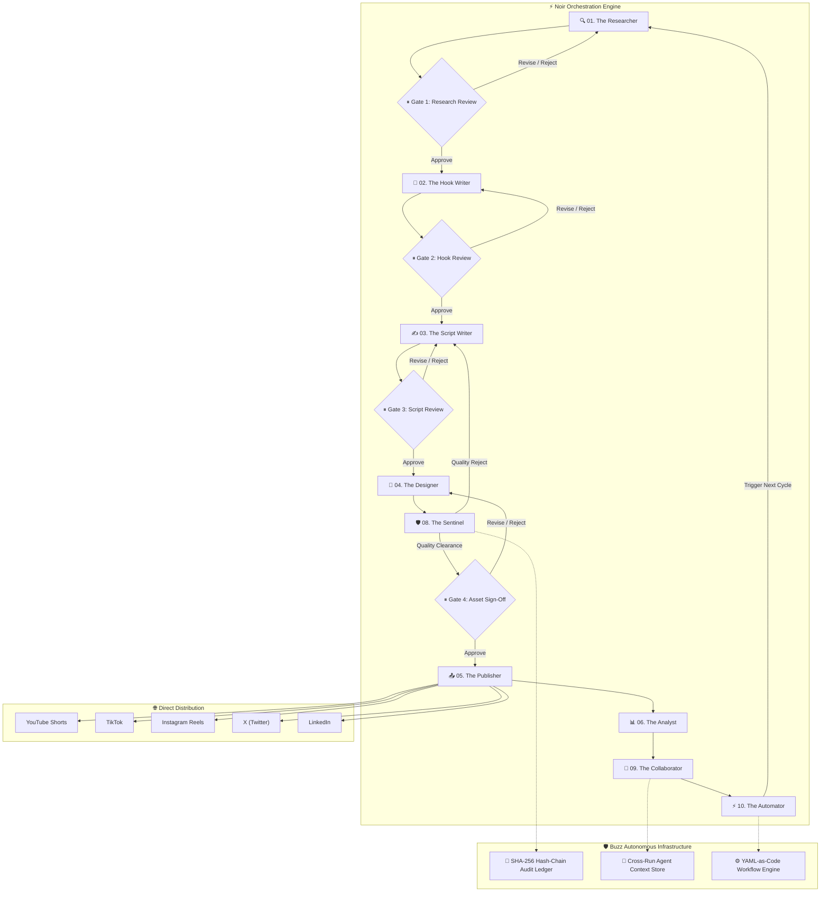

# ⚡ Noir — Autonomous Multi-Agent Content Engine

<div align="center">

[](https://python.org)
[](https://github.com/langchain-ai/langgraph)
[](https://github.com/pushkarugale/Noir)
[](https://github.com/pushkarugale/Noir)
[](https://opensource.org/licenses/MIT)

**Noir** is an enterprise-grade autonomous multi-agent content creation and publishing engine powered by **LangGraph**. Built as a clean, terminal-native system, ten specialized AI agents collaborate across viral research, copywriting, scripting, design, quality auditing, cross-run context synchronization, and automated multi-channel publishing with **cryptographic hash-chain auditing** and **interactive terminal approval gates**.

[Features](#-key-features) • [Buzz Architecture](#-buzz-inspired-architecture) • [Agents](#-the-10-ai-agents) • [Execution Modes](#-execution-modes) • [Quick Start](#-quick-start) • [Social Integrations](#-social-platform-integrations)

</div>

---

## 🌟 Key Features

- 🤖 **10 Autonomous AI Agents**: Specialized intelligence units operating in an orchestrated cyclic pipeline.
- 🛡️ **Sentinel Cryptographic Audit Trail**: Tamper-evident SHA-256 hash chains for all agent outputs and approval gate decisions inspired by Buzz's audit architecture.
- 🧠 **Collaborator Cross-Agent Memory**: Persistent session pooling and cross-run context stores so agents learn from historical performance across cycles.
- ⚡ **Automator YAML Workflow Engine**: Declarative workflows with dynamic triggers, cron schedules, and adaptive publishing window recommendations.
- 🛑 **Interactive Terminal Approval Gates**: Rich ANSI-styled terminal prompts for operator steering (Approve, Revise, Reject) with real-time virality and Sentinel quality scores.
- 🚀 **Autopilot Mode**: Run fully automated end-to-end cycles where gates meeting the Sentinel quality threshold (>= 80%) auto-clear without manual intervention.
- 🌐 **Direct Multi-Platform Auto-Posting**: Automated uploads to YouTube Shorts, TikTok, Instagram Reels, X (Twitter), LinkedIn, and Reddit.
- 🧠 **Multi-LLM Provider Support**: Dynamic routing across OpenAI (GPT-4o), Anthropic (Claude 3.7 Sonnet), and Google Gemini (Gemini 2.5 Flash / Pro).
- 🪶 **Zero UI Overhead**: Pure Python implementation with no web servers, node_modules, or browser dependencies required.

---

## 🏗️ System Architecture



---

## 🐝 Buzz-Inspired Architecture

Noir incorporates premier architectural patterns from the **Buzz autonomous agent ecosystem**:

1. **The Sentinel (Quality & Audit Gatekeeper)**:
   - Evaluates deliverables across 5 dimensions: Research Rigor, Hook Virality Velocity, Narrative Pacing, Visual Polish, and Brand Safety.
   - Enforces cryptographic SHA-256 hash chains (`pipeline/audit.py`) linking every state change in an immutable sequence.
2. **The Collaborator (Cross-Agent Context Protocol)**:
   - Employs session pooling and handoff protocols (`pipeline/context_store.py`) to maintain persistent memory across cycles.
   - Summarizes cross-platform learnings into context briefs available to all agents.
3. **The Automator (Workflow Engine)**:
   - Executes YAML-as-code automation recipes (`agents/automator.py`) supporting cron expressions, event triggers, and emergency circuit breakers.

---

## 🤖 The 10 AI Agents

| # | Agent | Department | Core Directive & Responsibilities |
|---|---|---|---|
| **01** | **The Researcher** | Research Dept. | Scours TikTok, YouTube Shorts, Instagram Reels, X, and Reddit for breakout trends before they peak. Scored viral opportunities. |
| **02** | **The Hook Writer** | Creative Dept. | Generates 10 high-converting hooks per idea using proven formulas (Contrarian, Explainer, Story, Proof). Identifies winning hooks. |
| **03** | **The Script Writer** | Creative Dept. | Writes platform-tailored scripts with strict timing: 3s Hook → High-Retention Value → Proof → Clear Call to Action. |
| **04** | **The Designer** | Design Dept. | Formulates visual briefs, carousel slide compositions, thumbnail typography directions, and AI image prompts. |
| **05** | **The Publisher** | Distribution | Executes direct authenticated API publishing across YouTube, TikTok, Instagram, X, and LinkedIn. |
| **06** | **The Analyst** | Insights Dept. | Measures cross-platform engagement and feeds tactical improvements into the cycle feedback loop. |
| **07** | **The Manager** | Operations | Controls LangGraph StateGraph flow, state checkpointing, and terminal telemetry displays. |
| **08** | **The Sentinel** | Quality & Audit | Buzz-inspired gatekeeper enforcing strict quality scoring and cryptographic hash-chain ledger verification. |
| **09** | **The Collaborator** | Orchestration | Coordinates cross-agent memory handoffs, session pooling, and knowledge graph persistence. |
| **10** | **The Automator** | Workflow Dept. | Declarative workflow executor, trigger evaluator, and predictive schedule recommendation engine. |

---

## 💻 Execution Modes

Noir runs completely inside your terminal:

### 1. Interactive Human-in-the-Loop Mode (Default)
```bash
python main.py
```
The pipeline pauses at checkpoints and prompts you in the terminal:
```text
⏸  CHECKPOINT: Gate 1: Research & Trend Review
   Sentinel Quality Score: 94/100 • Target Agent: researcher
   Found 12 candidate trends. Top trend:
   👉 "The AI trend nobody is talking about" (Virality: 9.1/10)

Action for researcher [A]pprove / [R]evise / [Q]uit: 
```
- Press `a` to approve and pass deliverables to the next agent.
- Press `r` to enter custom steering feedback for immediate re-prompting.
- Press `q` to abort the cycle.

### 2. Autonomous Autopilot Mode
```bash
python main.py --autopilot
```
Runs end-to-end through all 10 agents without stopping, automatically approving gates that clear the Sentinel quality threshold (default: >= 80%).

### 3. Custom Cycle & Threshold Flags
```bash
# Run cycle #3 with a strict 90% Sentinel quality bar
python main.py --cycle 3 --autopilot --threshold 90
```

---

## 🚀 Quick Start

### Prerequisites
- **Python 3.11+**
- **pip**

### 1. Clone the Repository
```bash
git clone https://github.com/pushkarugale/Noir-Vortex.git
cd Noir-Vortex
```

### 2. Set Up Python Virtual Environment
```bash
# Create virtual environment
python -m venv .venv

# Activate virtual environment
# Windows (PowerShell):
.venv\Scripts\Activate.ps1
# macOS / Linux:
source .venv/bin/activate

# Install dependencies
pip install -r requirements.txt
```

### 3. Configure Environment Variables
Copy `.env.example` to `.env` and configure your API keys:
```bash
cp .env.example .env
```

At minimum, configure **one LLM provider**:
```env
# Choose: "openai", "anthropic", or "google"
LLM_PROVIDER=google
GOOGLE_API_KEY=your_gemini_api_key
```

### 4. Run Noir
```bash
python main.py
```

---

## 📱 Social Platform Integrations

Add credentials in `.env` to enable direct auto-posting upon approving **Gate 04**:

### 📺 YouTube Shorts (YouTube Data API v3)
```env
YOUTUBE_API_KEY=AIzaSy...
YOUTUBE_CLIENT_ID=your_client_id.apps.googleusercontent.com
YOUTUBE_CLIENT_SECRET=GOCSPX-your_client_secret
YOUTUBE_REFRESH_TOKEN=1//04your_refresh_token
```

### 📸 Instagram Reels (Meta Graph API)
```env
INSTAGRAM_ACCESS_TOKEN=EAABw...
INSTAGRAM_BUSINESS_ACCOUNT_ID=1784140...
```

### 🎵 TikTok (Content Posting API)
```env
TIKTOK_ACCESS_TOKEN=act.your_token
TIKTOK_CLIENT_KEY=your_key
TIKTOK_CLIENT_SECRET=your_secret
```

### 🐦 X / Twitter (API v2)
```env
X_API_KEY=your_consumer_key
X_API_SECRET=your_consumer_secret
X_BEARER_TOKEN=your_bearer_token
X_ACCESS_TOKEN=your_access_token
X_ACCESS_TOKEN_SECRET=your_access_token_secret
```

### 💼 LinkedIn (Marketing API)
```env
LINKEDIN_ACCESS_TOKEN=AQV...
LINKEDIN_ORGANIZATION_ID=urn:li:organization:123456
```

---

## 🗂️ Clean Project Structure

```
Noir/
├── agents/                 # 10 Specialized AI Agents
│   ├── researcher.py       # Agent 01: Trend & Competitor Discovery
│   ├── hook_writer.py      # Agent 02: Viral Hook Formulas
│   ├── script_writer.py    # Agent 03: Script & Caption Generator
│   ├── designer.py         # Agent 04: Visual Briefs & Prompts
│   ├── publisher.py        # Agent 05: Direct API Dispatcher
│   ├── analyst.py          # Agent 06: Analytics & Closed-Loop Feedback
│   ├── manager.py          # Agent 07: State & Telemetry Supervisor
│   ├── sentinel.py         # Agent 08: Quality & Audit Gatekeeper (Buzz)
│   ├── collaborator.py     # Agent 09: Cross-Agent Context & Handoffs (Buzz)
│   ├── automator.py        # Agent 10: Workflow & Triggers Engine (Buzz)
│   └── state.py            # Global pipeline state schema
├── pipeline/               # LangGraph StateGraph & Infrastructure
│   ├── graph.py            # 10-Agent state machine with interrupt gates
│   ├── cli.py              # Terminal CLI runner with ANSI telemetry
│   ├── audit.py            # Cryptographic SHA-256 hash-chain ledger (Buzz)
│   ├── context_store.py    # Persistent cross-run memory store (Buzz)
│   ├── approval.py         # Human-in-the-loop approval handlers
│   └── scheduler.py        # Autonomous execution timer
├── platforms/              # Social media API clients
│   ├── youtube.py          # YouTube Data API v3 client
│   ├── instagram.py        # Meta Graph API client
│   ├── tiktok.py           # TikTok Content Posting client
│   ├── twitter.py          # X / Twitter API v2 client
│   ├── linkedin.py         # LinkedIn API client
│   └── reddit.py           # Reddit PRAW client
├── llm/                    # Multi-LLM provider router
│   └── provider.py         # LiteLLM client (Gemini, Claude, OpenAI)
├── config.py               # Central environment configuration
├── main.py                 # Application startup entry point
└── requirements.txt        # Lean Python dependencies
```

---

## 📜 License

This project is licensed under the **MIT License** — see the [LICENSE](LICENSE) file for details.

---

<div align="center">
Built by <b>Pushkar Ugale</b> • Powered by LangGraph & Buzz Architecture
</div>
